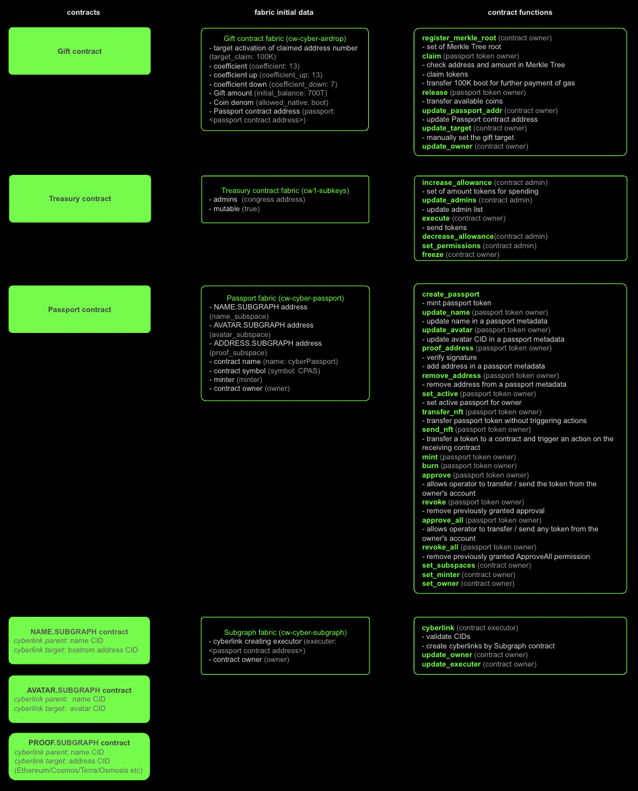
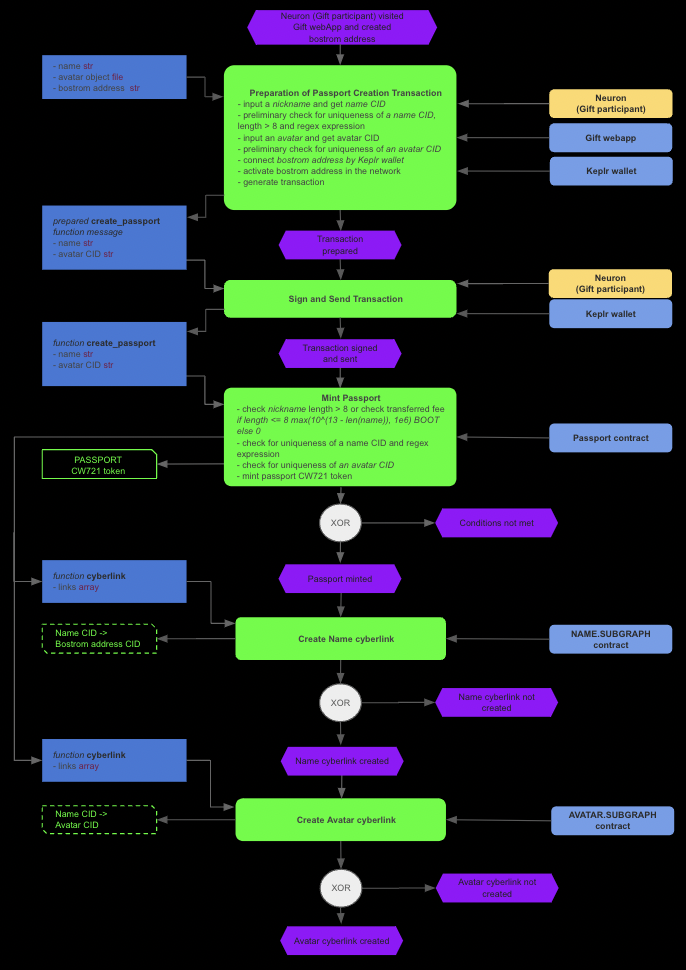
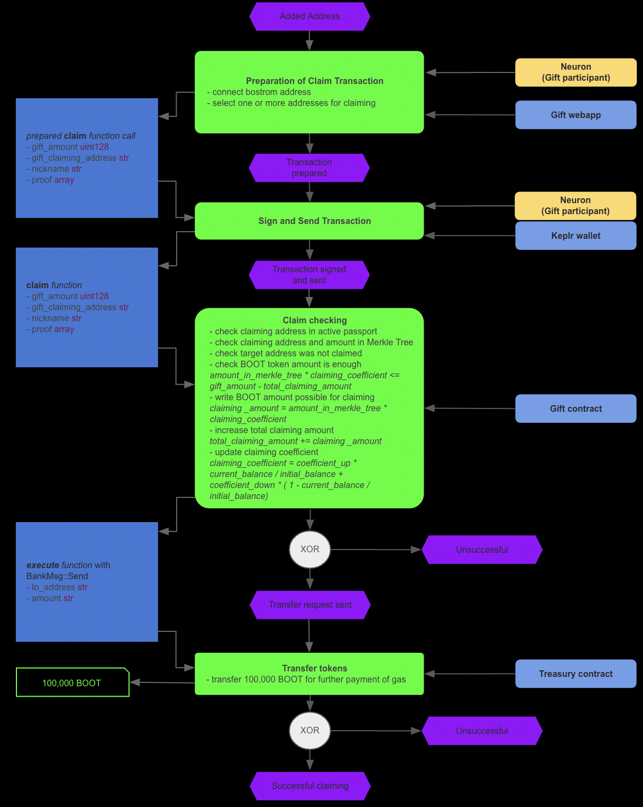
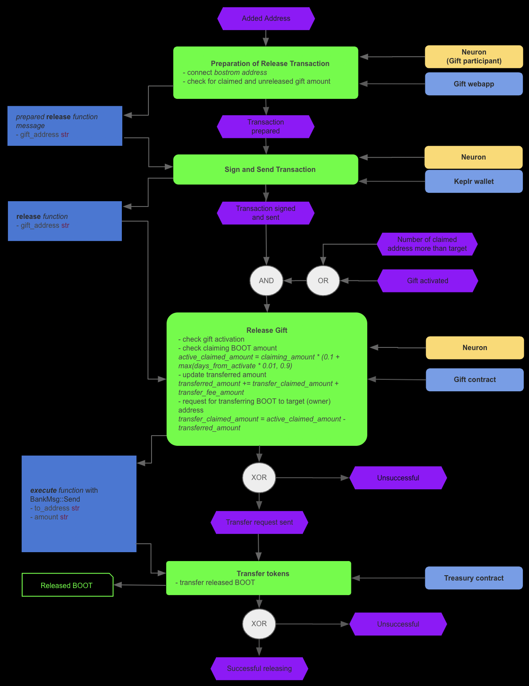

# cyberGift Contracts
## Contracts
### Gift Contract
[cw-cyber-airdrop](contracts/cw-cyber-airdrop)
### Passport Contract
[cw-cyber-passport](contracts/cw-cyber-passport)
### Subgraph Contract
[cw-cyber-subgraph](contracts/cw-cyber-subgraph)
### Treasury Contract
[cw1-subkeys](https://github.com/CosmWasm/cw-plus/tree/main/contracts/cw1-subkeys)
## Gift Execution

## Contracts Initial Data and Functions

## User Story
### Create Passport

### Prove Address

### Claim Gift

### Release Gift

## Load testing
[Jupyter notebook](testdata/generate_test_data/gift_and_passport_contracts_load_testing.ipynb)