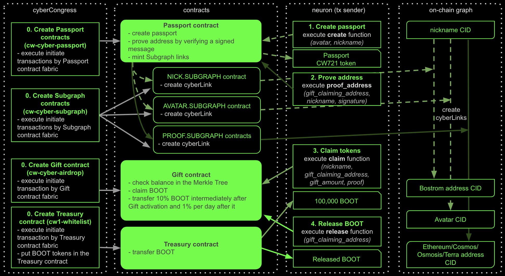
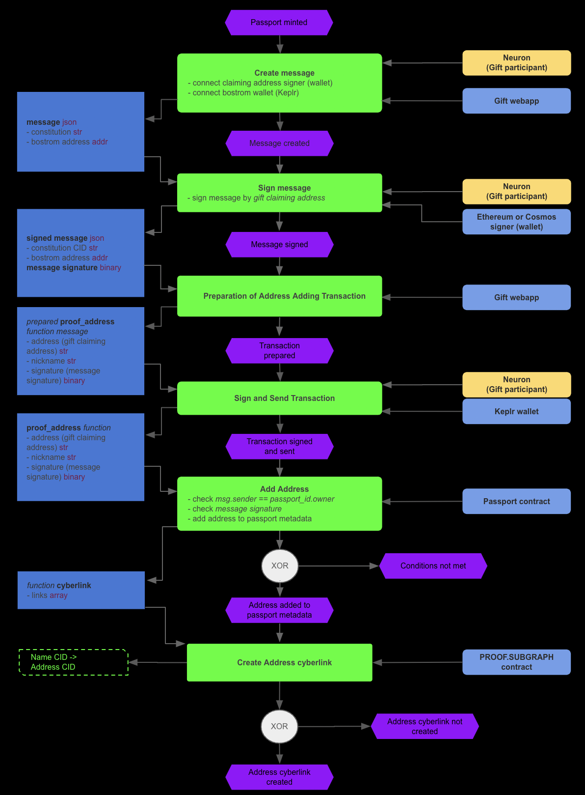

# cyberGift Contracts

```
docker run --rm -v "$(pwd)":/code \
  --mount type=volume,source="$(basename "$(pwd)")_cache",target=/code/target \
  --mount type=volume,source=registry_cache,target=/usr/local/cargo/registry \
  cosmwasm/workspace-optimizer:0.14.0
```

## Contracts
### Gift Contract
[cw-cyber-airdrop](contracts/cw-cyber-airdrop)
### Passport Contract
[cw-cyber-passport](contracts/cw-cyber-passport)
### Subgraph Contract
[cw-cyber-subgraph](contracts/cw-cyber-subgraph)
### Treasury Contract
[cw1-subkeys](https://github.com/CosmWasm/cw-plus/tree/main/contracts/cw1-subkeys)
## Gift Execution

## Contracts Initial Data and Functions

## User Story
### Create Passport

### Prove Address

### Claim Gift

### Release Gift

## Load testing
[Jupyter notebook](testdata/generate_test_data/gift_and_passport_contracts_load_testing.ipynb)

## Bounty
cyberGift contracts have treasury which works as a security proxy for claiming process. cyberCongress will gradually replenish the treasury to minimize the risks of a hack. All BOOT on a contract balance is subject to bounty. If you find a way to get BOOT from contracts - do, but please report on the vulnerability.
